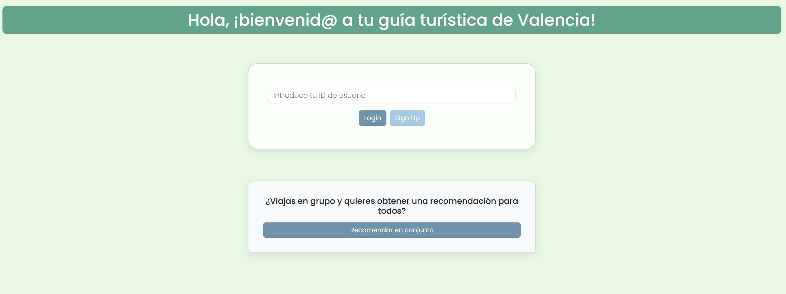
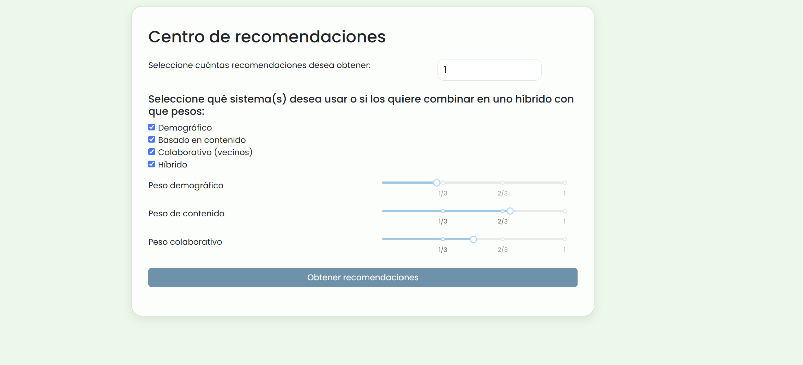
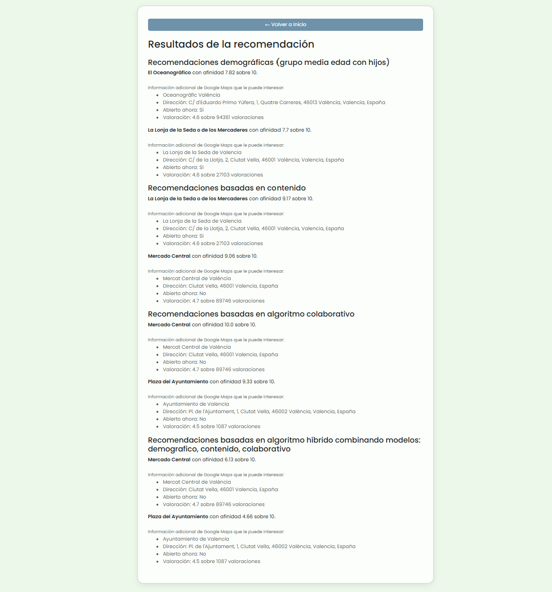

# 🎉 ValenciaTourRecommender

Sistema de recomendación para ayudarte a elegir las mejores atracciones turísticas de la ciudad de Valencia.

## 📸 Vista previa

### Pantalla de inicio de sesión



### Selección de algoritmo



### Resultados de recomendaciones


## ⚙️ Instalación y puesta en marcha (modo local)

1. Clona este repositorio

   ```bash
   git clone https://github.com/dierop/ValenciaTourRecommender.git
   cd ValenciaTourRecommender
   ```

2. Instala las dependencias

   ```bash
   pip install -r requirements.txt
   ```

3. Ejecuta la aplicación

   ```bash
   python app.py 
   ```

La aplicación se iniciará por defecto en [http://127.0.0.1:8050/](http://127.0.0.1:8050/). Abre tu navegador y empieza a descubrir Valencia de forma inteligente.

## ⚙️ Instalación y puesta en marcha (modo webapp)
1. Clona este repositorio

   ```bash
   git clone https://github.com/dierop/ValenciaTourRecommender.git
   cd ValenciaTourRecommender
   ```

2. Instala las dependencias

   ```bash
   pip install -r requirements.txt
   ```

3. Instala Ngrok, genera una cuenta de ngrok y obtén un auth_token

   ```bash
   ngrok config add-authtoken <YOUR_TOKEN>
   ```

4. Genera una URL recurrente siguiendo los pasos de [tutorial ngrok para dominio especifico](https://ngrok.com/blog-post/free-static-domains-ngrok-users) y publica el puerto 8050.

   ```bash
   ngrok http --url=<YOUR_URL> 8050
   ```
   
4. En Python ejecuta la app y abre en el navegador en <YOUR_URL>.

   ```bash
   python app.py
   ```
   
ngrok.exe http --url=marginally-hopeful-bull.ngrok-free.app 8050   
## 🛠️ Tecnologías utilizadas

* Python 3.10
* Plotly Dash
* Pandas
* NumPy
* Google Maps: Places API
* requests


## 📄 Licencia

Distribuido bajo la licencia MIT. Consulta el archivo LICENSE para más información.

---

Made with ❤️ in Valencia.
